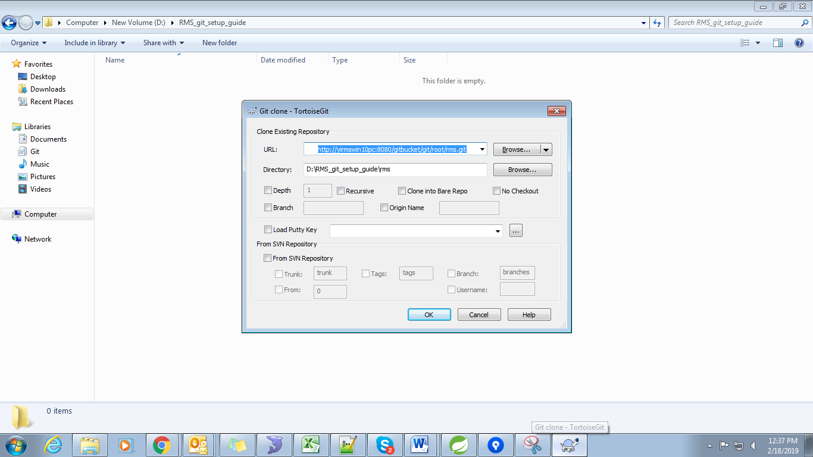
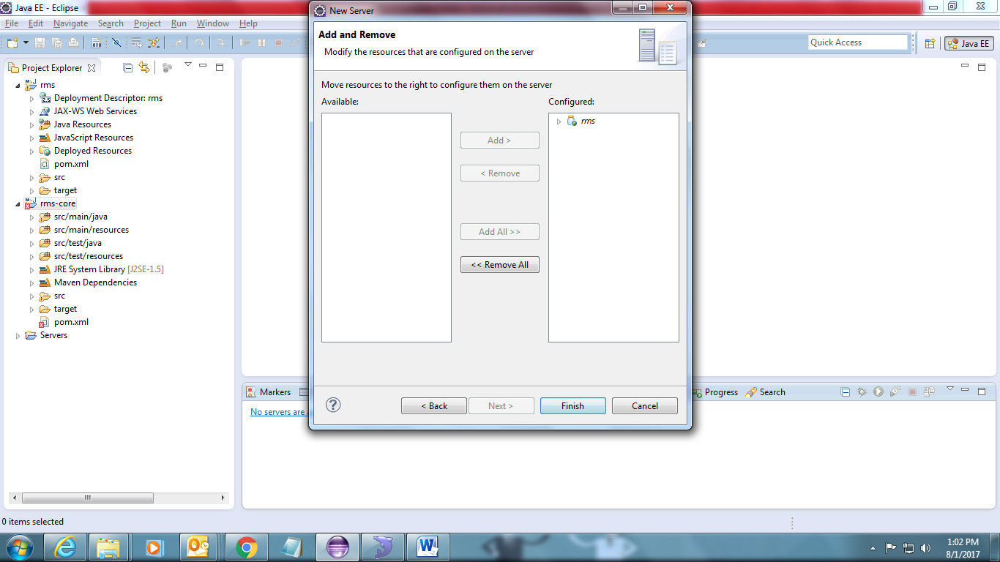

RMS: Resource Management System
===============================

How to do local setup of RMS:
-----------------------------

1. Prerequisite software’s:  Make sure below software are installed
  * JDK 1.7 or above
  *  Eclipse IDE
  *  MySQL Server v5.5 or above
  *  SQL Yog
  *  Apache Tomcat 7
  *  GIT   
 
2. Checkout code in your local using GIT
	##### URL: An [http://yirmswin10pc:8080/gitbucket/git/root/rms.git]()

	1. Clone the RMS project using GIT BASH or Turtoise GIT.
		

	2. Click on 'Git Clone' and paste clone URL.
		

	3. Click on 'OK' and clone the repository. 
		
	4. Reporsitory will be cloned. 
		

3. Import project in eclipse as Maven project1. 
	1. In eclipse, Go to "Existing Maven Project"
		

	2. Browse the path of checkout project and click on finish.
		
4. Add Tomcat server
	1. Open new server window and choose tomcat and enter "Server Name"
		

	2. Select rms and move it to right side.
		

	3. Click on Open Launch configuration(Press F3 on server). 
		
	4. Add below argument in VM Argument.
		-XX:+UseCompressedOops
		-XX:ReservedCodeCacheSize=96m
		-XX:+UseCodeCacheFlushing
		-ea
		-Dsun.io.useCanonCaches=false
		-Djava.net.preferIPv4Stack=true
		-DIafConfigSuffix=Local

		
		
	5. Click on Classpath:  
        	Add mysql-connector-java-5.1.9.jar by clicking Add External Jar
		Click to download: [mysql-connector-java-5.1.9.jar](http://yirmswin10pc:8080/gitbucket/root/rms/blob/master/setup_files/mysql-connector-java-5.1.9.jar) 

		

	6. Click on Apply and OK.
		

5. Connect to database in context.xml.
        1. Add below code before </context > tag

	   `
	    <Resource auth="Container" driverClassName="com.mysql.jdbc.Driver"
	     initialSize="5" maxActive="120" maxIdle="5" maxWait="5000" name="jdbc/rms"
	     password="root" poolPreparedStatements="true" type="javax.sql.DataSource"
	     url="jdbc:mysql://inidrrmstsrv01:3306/rms_3.1_test?zeroDateTimeBehavior=convertToNull" username="root" validationQuery="select 1" />
	   `

    **Note:  Please update DB details accordingly.**
		
	
	
	2. Add below configuration changes in tomcat server’s web.xml file.
	
	   `  
	    <init-param> 
		<param-name>mappedfile</param-name>
		<param-value>false</param-value>
	     </init-param

           `	
		
	

6. Add dto.jar at your respective location
   `C:\Users\username\.m2\repository\org\yash\dto\1.6`

7. Clean and build the project.

8. Clean tomcat and start.
	Use URL :  http://localhost:8080/rms to see the dashboard of RMS
	
